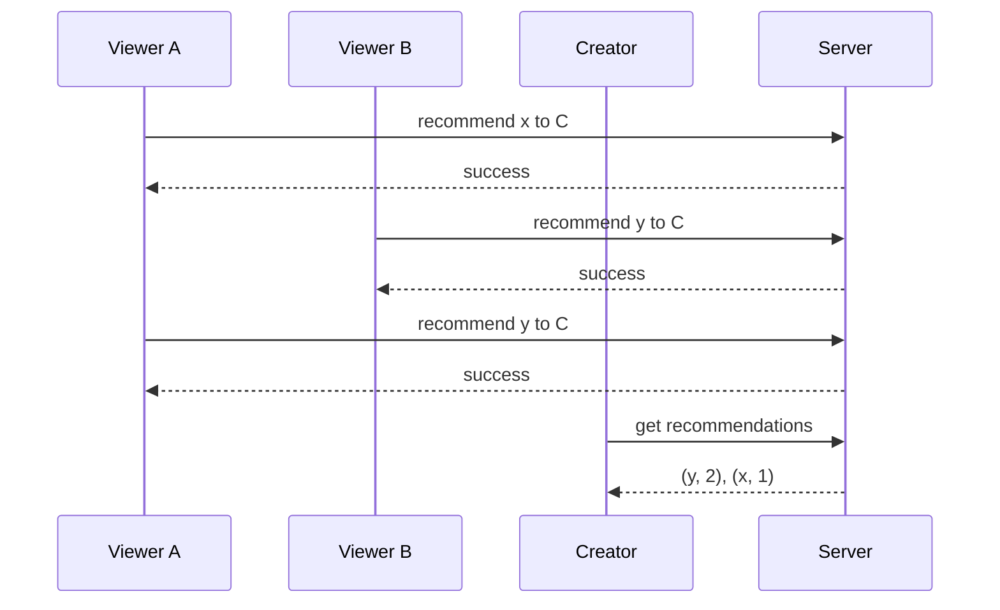

# FanCue

> [!WARNING]
> Project is in **Active Development**

A website that allows viewers to submit reaction content suggestions to their favorite streamers and video creators.

## `Interaction Flow`



## `Language & Tools`

> [!NOTE]
> Details may change

**Backend Language**: [Go](https://go.dev/)

- Great concurrency
- Simple syntax

**User Interface**: [Templ](https://templ.guide/)

- Templating language for Go
- Pass component data with Go structs

**Frontend Reactivity**: [Datastar](https://data-star.dev/)

- A lightweight hypermedia library/framework
- Combines capabilities of htmx with that of Alpine.js

**Database**: [SQLite3](https://sqlite.org)

- Very portable
- Easy deployment
- Should be sufficient for this read-heavy app

## `Local Deployment`

```bash
git clone git@github.com:encador/fancue.git
cd fancue
go mod download
go run .
```
